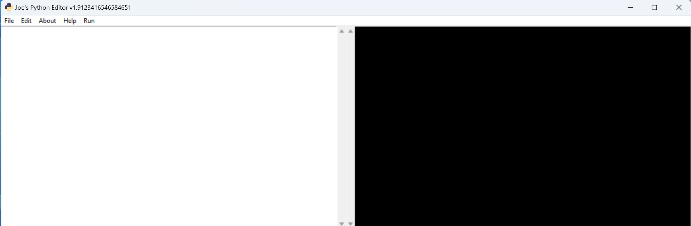

# PYTHON-Editor

***

## Simple Python Text Editor  
1) the files STEPS/ are a series of adding funcdtionality, culminating in gui.py  
2) the files were added to an .exe using auto-py-to-exe   found in /PACKAGE_GUI/output  -- gui.exe 
   --for some reason auto-py-to-exe doesn't want to package the icon file, which is also in that dir 
   --without the icon file it errors out... what a pita 
   --but.. even if python isn't installed locally, the app will still run, which is pretty cool 

***

***

***
